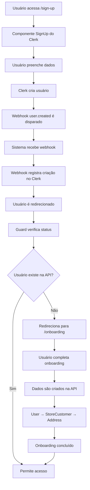

# Processo de Criação de Usuário no Clerk - Halinne Semijoias

Este documento explica como o usuário é criado diretamente no Clerk nesta aplicação e como funciona o fluxo completo de autenticação e sincronização.

## 📋 Visão Geral

A aplicação Halinne Semijoias utiliza o **Clerk** como provedor de autenticação principal, onde os usuários são criados diretamente através do componente `<SignUp />` do Clerk. O processo envolve:

1. **Criação no Clerk** - Usuário se registra via interface do Clerk
2. **Webhook de Sincronização** - Sistema recebe notificação do Clerk
3. **Onboarding Manual** - Usuário completa dados na API externa
4. **Guards de Proteção** - Sistema verifica se dados estão completos

## 🔄 Fluxo Completo de Criação

### 1. Registro do Usuário (Clerk)

**Localização:** `src/app/sign-up/[[...sign-up]]/page.tsx`

```tsx
import { SignUp } from "@clerk/nextjs";

export default function SignUpPage() {
  return (
    <div className="min-h-screen flex items-center justify-center bg-background">
      <div className="w-full max-w-md">
        <SignUp />
      </div>
    </div>
  );
}
```

**Como funciona:**

- O usuário acessa `/sign-up`
- O componente `<SignUp />` do Clerk renderiza o formulário de registro
- O Clerk gerencia todo o processo de criação de conta
- Após criação bem-sucedida, o usuário é redirecionado

### 2. Webhook de Sincronização

**Localização:** `src/actions/webhooks/clerk-user-actions.ts`

Quando um usuário é criado no Clerk, o sistema recebe um webhook `user.created`:

```typescript
export async function createUserFromClerk(
  userData: ClerkUserData
): Promise<WebhookResult> {
  try {
    console.log(
      `🔍 [createUserFromClerk] Webhook user.created recebido para: ${userData.id}`
    );

    // Extrair email do usuário
    const email = userData.email_addresses?.[0]?.email_address;
    if (!email) {
      return {
        success: false,
        error: "Email não encontrado nos dados do usuário",
      };
    }

    // IMPORTANTE: O webhook apenas registra que o usuário foi criado no Clerk
    // O usuário deve ser criado MANUALMENTE via API seguindo o guia
    console.log(
      `ℹ️ [createUserFromClerk] Usuário ${userData.id} criado no Clerk`
    );
    console.log(
      `ℹ️ [createUserFromClerk] User deve ser criado MANUALMENTE via API seguindo o guia`
    );
    console.log(
      `ℹ️ [createUserFromClerk] Ordem obrigatória: User → StoreCustomer → Address`
    );

    return {
      success: true,
      message: `Usuário ${userData.id} deve ser criado manualmente via API`,
    };
  } catch (error: any) {
    // ... tratamento de erro
  }
}
```

**Pontos importantes:**

- O webhook **NÃO cria** o usuário automaticamente na API externa
- Apenas registra que o usuário foi criado no Clerk
- O usuário deve ser criado **MANUALMENTE** via processo de onboarding

### 3. Processo de Onboarding

**Localização:** `src/actions/onboarding/complete-onboarding.ts`

Após o registro no Clerk, o usuário é direcionado para completar o onboarding:

```typescript
export async function completeOnboarding(
  formData: FormData
): Promise<OnboardingResult> {
  try {
    // Obter dados do usuário do Clerk
    const clerkUser = await currentUser();
    if (!clerkUser) {
      return {
        success: false,
        error: "Usuário não autenticado",
      };
    }

    // Extrair dados do FormData
    const userData = {
      id: clerkUser.id, // Usar o ID do Clerk como ID na nossa API
      firstName: formData.get("firstName") as string,
      lastName: formData.get("lastName") as string,
      email: formData.get("email") as string,
      imgUrl: clerkUser.imageUrl || undefined,
    };

    const cpf = (formData.get("cpf") as string) || undefined;
    const addressData = {
      name: formData.get("addressName") as string,
      street: formData.get("street") as string,
      // ... outros campos de endereço
    };

    // Fazer requisição para a rota unificada da API externa
    const response = await serverApi.post("/onboarding", {
      user: userData,
      storeCustomer: cpf ? { cpf } : undefined,
      address: addressData,
    });

    if (response.status === 201) {
      // Revalidar rotas relacionadas
      await revalidateUserRoutes();
      await revalidateOnboardingRoutes();

      return {
        success: true,
        data: response.data.data,
      };
    }
  } catch (error: any) {
    // ... tratamento de erro
  }
}
```

**Ordem obrigatória de criação:**

1. **User** - Dados básicos do usuário
2. **StoreCustomer** - Dados específicos da loja (CPF, etc.)
3. **Address** - Endereço do usuário

### 4. Verificação de Status

**Localização:** `src/actions/onboarding/check-onboarding-status.ts`

O sistema verifica se o usuário completou o onboarding:

```typescript
export async function checkOnboardingStatus(): Promise<OnboardingStatus> {
  try {
    const { userId } = await auth();

    if (!userId) {
      return {
        needsOnboarding: true,
        userExists: false,
        storeCustomerExists: false,
        hasAddress: false,
      };
    }

    // Usar a rota única de onboarding que retorna todos os dados necessários
    const response = await serverApi.get(`/onboarding/${userId}`);

    if (response.status === 200) {
      const data = response.data.data;
      const meta = data.meta;

      return {
        needsOnboarding:
          !meta.userExists || !meta.storeCustomerExists || !meta.hasAddress,
        userExists: meta.userExists,
        storeCustomerExists: meta.storeCustomerExists,
        hasAddress: meta.hasAddress,
        user: data.user,
        storeCustomer: data.storeCustomer,
        address: data.addresses?.[0] || null,
      };
    }
  } catch (error: any) {
    // ... tratamento de erro
  }
}
```

## 🛡️ Guards de Proteção

### 1. Middleware de Autenticação

**Localização:** `src/middleware.ts`

```typescript
import { clerkMiddleware, createRouteMatcher } from "@clerk/nextjs/server";

const isProtectedRoute = createRouteMatcher([
  "/favoritos(.*)",
  "/pedidos(.*)",
  "/checkout(.*)",
  "/api(.*)",
]);

export default clerkMiddleware(async (auth, req) => {
  // Proteger rotas que requerem autenticação
  if (isProtectedRoute(req)) {
    await auth.protect();
  }
});
```

### 2. Guard de Onboarding

**Localização:** `src/components/OnboardingGuardWrapper.tsx`

O sistema usa um guard client-side para verificar se o usuário completou o onboarding:

```typescript
// Hook para verificar onboarding
export function useOnboardingCheck(): OnboardingCheckResult {
  const { userId, isLoaded } = useAuth();
  const router = useRouter();

  useEffect(() => {
    if (!isLoaded || !userId) return;

    const checkOnboarding = async () => {
      try {
        const response = await fetch(`/api/onboarding/status?userId=${userId}`);
        const data = await response.json();

        if (data.needsOnboarding) {
          // Redirecionar para onboarding
          router.push("/onboarding");
        }
      } catch (err) {
        // Em caso de erro, assumir que precisa de onboarding
        router.push("/onboarding");
      }
    };

    checkOnboarding();
  }, [isLoaded, userId, router]);
}
```

### 3. Layouts Protegidos

**Localização:** `src/app/(main)/user-required/layout.tsx`

```typescript
import { OnboardingGuardWrapper } from "@/components/OnboardingGuardWrapper";

export default function UserRequiredLayout({
  children,
}: {
  children: React.ReactNode;
}) {
  // Usar client-side guard para evitar páginas dinâmicas
  return <OnboardingGuardWrapper>{children}</OnboardingGuardWrapper>;
}
```

## 🔄 Sincronização Manual

### 1. Server Action de Sincronização

**Localização:** `src/actions/users/sync-clerk-user.ts`

```typescript
export async function syncClerkUser(): Promise<SyncUserResult> {
  try {
    const { userId } = await auth();
    if (!userId) {
      return {
        success: false,
        error: "Usuário não autenticado",
      };
    }

    // Obter dados do usuário do Clerk
    const clerkUser = await currentUser();
    if (!clerkUser) {
      return {
        success: false,
        error: "Usuário não encontrado no Clerk",
      };
    }

    // Verificar se o usuário já existe na API
    try {
      const existingUserResponse = await serverApi.get(`/users/${userId}`);
      if (existingUserResponse.status === 200) {
        return {
          success: true,
          data: existingUserResponse.data,
          message: "Usuário já existe na API",
        };
      }
    } catch (error: any) {
      if (error.response?.status !== 404) {
        throw error;
      }
    }

    // Criar novo usuário na nossa API
    const createPayload = {
      id: userId, // Usar o ID do Clerk como ID na nossa API
      firstName: clerkUser.firstName || "Usuário",
      lastName: clerkUser.lastName || "",
      email: email,
      role: "CUSTOMER", // Role padrão para novos usuários
      imgUrl: clerkUser.imageUrl,
    };

    const createResponse = await serverApi.post("/users", createPayload);

    if (createResponse.status === 201) {
      return {
        success: true,
        data: createResponse.data,
        message: "Usuário criado com sucesso",
      };
    }
  } catch (error) {
    // ... tratamento de erro
  }
}
```

## 📱 Hooks de Verificação

### 1. Hook de Onboarding

**Localização:** `src/hooks/use-onboarding-check.ts`

```typescript
export function useOnboardingCheck(): OnboardingCheckResult {
  const { userId, isLoaded } = useAuth();
  const router = useRouter();

  useEffect(() => {
    if (!isLoaded || !userId) return;

    const checkOnboarding = async () => {
      try {
        const response = await fetch(`/api/onboarding/status?userId=${userId}`);
        const data = await response.json();

        if (data.needsOnboarding) {
          setNeedsOnboarding(true);
          router.push("/onboarding");
        } else {
          setNeedsOnboarding(false);
        }
      } catch (err) {
        // Em caso de erro, assumir que precisa de onboarding
        setNeedsOnboarding(true);
        router.push("/onboarding");
      }
    };

    checkOnboarding();
  }, [isLoaded, userId, router]);

  return {
    isLoading,
    needsOnboarding,
    error,
  };
}
```

### 2. Hook de Setup do Usuário

**Localização:** `src/hooks/use-user-setup.ts`

```typescript
export function useUserSetup(): UseUserSetupResult {
  const { isSignedIn, isLoaded, user } = useUser();
  const router = useRouter();

  useEffect(() => {
    if (isLoaded && isSignedIn && user && !hasChecked) {
      checkSetupNeeded();
    }
  }, [isLoaded, isSignedIn, user, hasChecked]);

  const checkSetupNeeded = async () => {
    try {
      const result = await checkUserSync();

      if (result.success) {
        // Usuário já existe na API, não precisa de setup
        setNeedsSetup(false);
      } else {
        // Usuário não existe na API, precisa de setup
        setNeedsSetup(true);
        router.push("/onboarding");
      }
    } catch (err) {
      setError("Erro ao verificar configuração do usuário");
    }
  };

  return {
    needsSetup,
    isLoading,
    error,
  };
}
```

## 🎯 Páginas e Componentes

### 1. Página de Onboarding

**Localização:** `src/app/(main)/onboarding/page.tsx`

```tsx
import { OnboardingForm } from "@/components/OnboardingForm";

export default function OnboardingPage() {
  return (
    <div className="min-h-screen bg-gradient-to-br pt-16">
      <OnboardingForm />
    </div>
  );
}
```

### 2. Páginas Protegidas

**Localização:** `src/app/(main)/user-required/`

Páginas que requerem dados completos do usuário:

- `/user-required/checkout/` - Checkout
- `/user-required/cashback/` - Cashback
- `/user-required/test-guard/` - Teste do guard

## 🔧 Configuração do Webhook

### 1. Variáveis de Ambiente

```env
CLERK_WEBHOOK_SECRET=whsec_xxxxxxxxxxxxxxxxxxxxxxxxxxxxxxxx
```

### 2. Endpoint do Webhook

**URL:** `https://seu-dominio.com/api/webhooks/clerk`

**Eventos configurados:**

- `user.created` - Usuário criado no Clerk
- `user.updated` - Usuário atualizado no Clerk
- `user.deleted` - Usuário deletado no Clerk

## 📊 Fluxo de Dados



## ⚠️ Pontos Importantes

### 1. Criação Manual Obrigatória

- O webhook **NÃO cria** automaticamente o usuário na API externa
- O usuário deve ser criado **MANUALMENTE** via processo de onboarding
- A ordem de criação é obrigatória: **User → StoreCustomer → Address**

### 2. ID do Clerk como ID da API

- O ID do usuário no Clerk é usado como ID na API externa
- Isso garante consistência entre os sistemas
- Facilita a sincronização de dados

### 3. Guards Client-Side

- O sistema usa guards client-side para evitar páginas dinâmicas
- Isso mantém a performance do Next.js
- Verificações são feitas no lado do cliente

### 4. Revalidação de Cache

- Após criação/atualização, o sistema revalida as rotas relacionadas
- Usa funções centralizadas de revalidação
- Mantém o cache sempre atualizado

## 🚨 Troubleshooting

### Problema: Usuário não é redirecionado para onboarding

**Solução:**

1. Verificar se o webhook está configurado corretamente
2. Verificar se `CLERK_WEBHOOK_SECRET` está definido
3. Verificar logs do webhook no console

### Problema: Onboarding não completa

**Solução:**

1. Verificar se a API externa está acessível
2. Verificar se os dados estão sendo enviados corretamente
3. Verificar se a ordem de criação está sendo respeitada

### Problema: Guard não funciona

**Solução:**

1. Verificar se o hook `useOnboardingCheck` está sendo usado
2. Verificar se a rota `/api/onboarding/status` está funcionando
3. Verificar se o usuário está autenticado

## 📚 Referências

- [Documentação do Clerk](https://clerk.com/docs)
- [Webhook Setup Instructions](./WEBHOOK_SETUP_INSTRUCTIONS.md)
- [Clerk Webhook Setup](./CLERK_WEBHOOK_SETUP.md)
- [Onboarding Implementation Summary](./ONBOARDING_IMPLEMENTATION_SUMMARY.md)

---

**Última atualização:** 2025-01-15  
**Versão:** 1.0.0  
**Status:** Documentação Ativa
