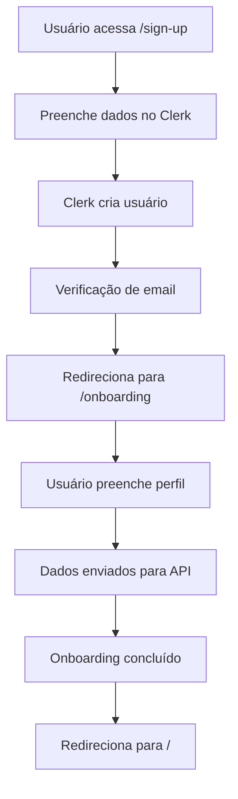
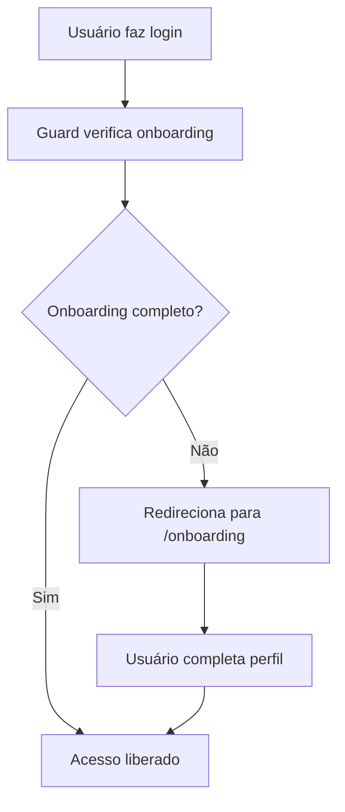

# Implementação do Sistema de Onboarding - SaintPharma App

Este documento explica como foi implementado o sistema de onboarding manual seguindo o guia do Clerk, onde os usuários são criados diretamente no Clerk e depois completam o perfil manualmente.

## 📋 Visão Geral

O sistema implementado segue o padrão descrito no guia `CLERK_USER_CREATION_PROCESS.md`:

1. **Criação no Clerk** - Usuário se registra via interface do Clerk
2. **Redirecionamento para Onboarding** - Após criação bem-sucedida, usuário é direcionado para completar perfil
3. **Onboarding Manual** - Usuário preenche dados na API externa
4. **Guards de Proteção** - Sistema verifica se dados estão completos

## 🏗️ Estrutura Implementada

### 1. Tipos TypeScript (`types/onboarding.ts`)

```typescript
export interface OnboardingData {
  user: {
    id: string;
    firstName: string;
    lastName: string;
    email: string;
    imgUrl?: string;
  };
  storeCustomer?: {
    cpf?: string;
  };
  address: {
    name: string;
    street: string;
    number: string;
    complement?: string;
    neighborhood: string;
    city: string;
    state: string;
    zipCode: string;
    country: string;
  };
}
```

### 2. Serviço de Onboarding (`services/onboarding.ts`)

- `completeOnboarding()` - Cria usuário na API externa
- `checkOnboardingStatus()` - Verifica se usuário completou onboarding
- `syncClerkUser()` - Sincroniza dados do Clerk (para casos especiais)

### 3. Hook de Verificação (`hooks/useOnboardingCheck.ts`)

Hook que verifica automaticamente se o usuário precisa completar o onboarding e redireciona se necessário.

### 4. Guard de Proteção (`components/OnboardingGuardWrapper.tsx`)

Componente que envolve as rotas protegidas e verifica se o usuário completou o onboarding.

### 5. Formulário de Onboarding (`components/OnboardingForm.tsx`)

Formulário completo para coleta de dados do usuário:

- Dados pessoais (nome, sobrenome, email, CPF)
- Endereço completo
- Validações e tratamento de erros

### 6. Página de Onboarding (`app/onboarding.tsx`)

Página dedicada para o processo de onboarding.

## 🔄 Fluxo de Funcionamento

### 1. Registro de Novo Usuário



### 2. Login de Usuário Existente



## 🛡️ Guards de Proteção

### 1. Guard Principal

O `OnboardingGuardWrapper` é aplicado em todas as rotas protegidas através do `_layout.tsx`:

```typescript
<OnboardingGuardWrapper>
  <Tabs>{/* Rotas protegidas */}</Tabs>
</OnboardingGuardWrapper>
```

### 2. Verificação Automática

O hook `useOnboardingCheck` verifica automaticamente:

- Se o usuário está autenticado
- Se o onboarding foi completado
- Redireciona para `/onboarding` se necessário

## 📱 Interface do Usuário

### 1. Formulário de Onboarding

- **Dados Pessoais**: Nome, sobrenome, email, CPF (opcional)
- **Endereço**: Nome do endereço, rua, número, complemento, bairro, cidade, estado, CEP, país
- **Validações**: Campos obrigatórios marcados com \*
- **Feedback**: Loading states e mensagens de erro

### 2. Estados de Loading

- Verificação de autenticação
- Verificação de status do onboarding
- Envio do formulário
- Feedback visual em todas as etapas

## 🔧 Configuração da API

### 1. Endpoints Utilizados

- `POST /onboarding` - Cria usuário completo (User + StoreCustomer + Address)
- `GET /onboarding/{userId}` - Verifica status do onboarding

### 2. Headers Necessários

```typescript
{
  "Content-Type": "application/json",
  "Authorization": "Bearer {API_TOKEN}"
}
```

### 3. Estrutura de Dados

O sistema envia dados na ordem obrigatória:

1. **User** - Dados básicos do usuário
2. **StoreCustomer** - Dados específicos da loja (CPF, etc.)
3. **Address** - Endereço do usuário

## 🚀 Como Usar

### 1. Para Desenvolvedores

1. O sistema funciona automaticamente após implementação
2. Usuários novos são direcionados para onboarding
3. Usuários existentes são verificados automaticamente
4. Guards protegem todas as rotas necessárias

### 2. Para Usuários

1. **Novo usuário**: Registra → Verifica email → Completa perfil → Acessa app
2. **Usuário existente**: Faz login → Sistema verifica perfil → Acessa app ou completa perfil

## ⚠️ Pontos Importantes

### 1. ID do Clerk como ID da API

- O ID do usuário no Clerk é usado como ID na API externa
- Isso garante consistência entre os sistemas
- Facilita a sincronização de dados

### 2. Ordem de Criação Obrigatória

- **User** → **StoreCustomer** → **Address**
- A API externa deve respeitar esta ordem
- Falha em qualquer etapa impede a criação completa

### 3. Tratamento de Erros

- Mensagens de erro traduzidas para português
- Fallbacks para casos de erro de rede
- Logs detalhados para debugging

### 4. Performance

- Verificações são feitas apenas quando necessário
- Cache de status do onboarding
- Loading states para melhor UX

## 🧪 Testes

### 1. Cenários de Teste

1. **Novo usuário**: Registro → Onboarding → Acesso
2. **Usuário existente**: Login → Verificação → Acesso
3. **Erro de rede**: Fallback para onboarding
4. **Dados inválidos**: Validação e feedback

### 2. Debugging

- Logs detalhados em todas as etapas
- Console logs com prefixos identificadores
- Estados de erro bem definidos

## 📚 Arquivos Relacionados

- `types/onboarding.ts` - Tipos TypeScript
- `services/onboarding.ts` - Lógica de negócio
- `hooks/useOnboardingCheck.ts` - Hook de verificação
- `components/OnboardingGuardWrapper.tsx` - Guard de proteção
- `components/OnboardingForm.tsx` - Formulário de onboarding
- `app/onboarding.tsx` - Página de onboarding
- `app/_layout.tsx` - Layout principal com guards
- `app/(auth)/sign-up.tsx` - Registro com redirecionamento
- `app/(auth)/sign-in.tsx` - Login com verificação

## 🔄 Próximos Passos

1. **Testes**: Implementar testes automatizados
2. **Analytics**: Adicionar tracking de conversão
3. **Otimizações**: Melhorar performance das verificações
4. **UX**: Adicionar animações e transições
5. **Acessibilidade**: Melhorar suporte a screen readers

---

**Última atualização:** 2025-01-15  
**Versão:** 1.0.0  
**Status:** Implementação Completa
