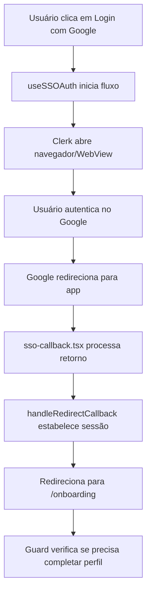

# Guia de Configuração do SSO - SaintPharma App

Este documento explica como configurar o login via SSO (Single Sign-On) no React Native com Clerk, incluindo a página de callback para interceptar o retorno da autenticação.

## 📋 Visão Geral

O sistema de SSO implementado inclui:

1. **Página de Callback** - Intercepta o retorno do Clerk após autenticação
2. **Hook de SSO** - Gerencia o fluxo de autenticação SSO
3. **Deep Linking** - Configuração para redirecionamento correto
4. **Integração com Onboarding** - Verifica se usuário precisa completar perfil

## 🏗️ Estrutura Implementada

### 1. Página de Callback (`app/sso-callback.tsx`)

```typescript
export default function SSOCallbackScreen() {
  const { handleRedirectCallback, isSignedIn, isLoaded } = useAuth();
  const router = useRouter();

  useEffect(() => {
    const processCallback = async () => {
      await handleRedirectCallback();

      if (isSignedIn) {
        router.replace("/onboarding");
      } else {
        router.replace("/(auth)/sign-in");
      }
    };

    if (isLoaded) {
      processCallback();
    }
  }, [isLoaded, handleRedirectCallback, isSignedIn, router]);
}
```

**Funcionalidades:**

- Processa o callback do Clerk após autenticação SSO
- Redireciona para onboarding se usuário autenticado
- Redireciona para login se houver erro
- Estados de loading e tratamento de erros

### 2. Hook de SSO (`hooks/useSSOAuth.ts`)

```typescript
export function useSSOAuth() {
  const { startSSOFlow } = useSSO();
  const router = useRouter();

  const handleSSOLogin = async (strategy, identifier?) => {
    const redirectUrl = AuthSession.makeRedirectUri({
      scheme: "saintpharma-app",
      path: "sso-callback",
    });

    const { createdSessionId, setActive } = await startSSOFlow({
      strategy,
      redirectUrl,
      ...(identifier && { identifier }),
    });

    if (createdSessionId) {
      await setActive!({ session: createdSessionId });
      router.replace("/onboarding");
    }
  };
}
```

**Funcionalidades:**

- Suporte a múltiplas estratégias SSO (Google, GitHub, Enterprise)
- Geração automática de URL de redirecionamento
- Tratamento de erros traduzidos
- Integração com sistema de onboarding

### 3. Configuração de Deep Linking

**app.json:**

```json
{
  "expo": {
    "scheme": "saintpharma-app",
    "plugins": ["expo-router"]
  }
}
```

**URL de Redirecionamento:**

```
saintpharma-app://sso-callback
```

## 🔄 Fluxo de Funcionamento

### 1. Login via SSO



### 2. Estratégias SSO Suportadas

- **Google OAuth** (`oauth_google`)
- **GitHub OAuth** (`oauth_github`)
- **SSO Empresarial** (`enterprise_sso`)

## 🛠️ Configuração Necessária

### 1. Configuração do Clerk Dashboard

1. **Acesse o Clerk Dashboard**
2. **Configure OAuth Providers:**

   - Google: Adicione Client ID e Secret
   - GitHub: Adicione Client ID e Secret
   - Enterprise: Configure conexões SSO

3. **Configure Redirect URLs:**
   ```
   saintpharma-app://sso-callback
   ```

### 2. Configuração do Google OAuth

1. **Google Cloud Console:**

   - Crie um projeto ou use existente
   - Ative Google+ API
   - Crie credenciais OAuth 2.0
   - Adicione redirect URI: `saintpharma-app://sso-callback`

2. **Clerk Dashboard:**
   - Cole Client ID e Secret do Google
   - Configure redirect URL

### 3. Configuração do GitHub OAuth

1. **GitHub Developer Settings:**

   - Crie uma nova OAuth App
   - Authorization callback URL: `saintpharma-app://sso-callback`

2. **Clerk Dashboard:**
   - Cole Client ID e Secret do GitHub
   - Configure redirect URL

## 📱 Como Usar

### 1. Para Desenvolvedores

```typescript
import { useSSOAuth } from "../hooks/useSSOAuth";

function LoginScreen() {
  const { handleGoogleSSO, handleGitHubSSO, isLoading } = useSSOAuth();

  return (
    <View>
      <TouchableOpacity onPress={handleGoogleSSO} disabled={isLoading}>
        <Text>Login com Google</Text>
      </TouchableOpacity>

      <TouchableOpacity onPress={handleGitHubSSO} disabled={isLoading}>
        <Text>Login com GitHub</Text>
      </TouchableOpacity>
    </View>
  );
}
```

### 2. Para Usuários

1. **Clica em "Login com Google/GitHub"**
2. **É redirecionado para o provedor**
3. **Faz login no provedor**
4. **É redirecionado de volta para o app**
5. **Sistema verifica se precisa completar perfil**
6. **Acessa o app normalmente**

## ⚠️ Pontos Importantes

### 1. Deep Linking

- O esquema `saintpharma-app` deve ser único
- Deve corresponder ao configurado no Clerk
- Funciona em iOS e Android

### 2. Segurança

- URLs de redirecionamento são validadas pelo Clerk
- Tokens são gerenciados automaticamente
- Sessões são estabelecidas de forma segura

### 3. Tratamento de Erros

- Erros de rede são tratados
- Cancelamento pelo usuário é detectado
- Fallbacks para login manual

### 4. Performance

- WebBrowser é pré-aquecido
- URLs são geradas dinamicamente
- Loading states em todas as operações

## 🧪 Testes

### 1. Cenários de Teste

1. **Login bem-sucedido**: Google → Callback → Onboarding
2. **Login cancelado**: Usuário cancela → Retorna ao login
3. **Erro de rede**: Falha de conexão → Mensagem de erro
4. **Usuário existente**: Login → Verificação → App

### 2. Debugging

- Logs detalhados em todas as etapas
- Console logs com prefixos identificadores
- Estados de loading bem definidos

## 🔧 Troubleshooting

### Problema: Callback não é interceptado

**Solução:**

1. Verificar se o esquema está correto no app.json
2. Verificar se a URL de redirecionamento está configurada no Clerk
3. Verificar se a rota `sso-callback` está registrada

### Problema: Erro de redirect URL

**Solução:**

1. Verificar se a URL está na lista de URLs permitidas no Clerk
2. Verificar se o esquema corresponde ao configurado
3. Verificar se não há caracteres especiais

### Problema: SSO não inicia

**Solução:**

1. Verificar se o provedor OAuth está configurado no Clerk
2. Verificar se as credenciais estão corretas
3. Verificar se o WebBrowser está funcionando

## 📚 Arquivos Relacionados

- `app/sso-callback.tsx` - Página de callback
- `hooks/useSSOAuth.ts` - Hook de SSO
- `app/(auth)/sign-in.tsx` - Tela de login atualizada
- `app/(auth)/sign-up.tsx` - Tela de registro atualizada
- `app/_layout.tsx` - Layout com rota de callback
- `app.json` - Configuração de deep linking

## 🔄 Próximos Passos

1. **Configurar provedores OAuth** no Clerk Dashboard
2. **Testar fluxo completo** em dispositivos reais
3. **Adicionar mais provedores** (Microsoft, Apple, etc.)
4. **Implementar SSO empresarial** se necessário
5. **Adicionar analytics** para tracking de conversão

---

**Última atualização:** 2025-01-15  
**Versão:** 1.0.0  
**Status:** Implementação Completa
