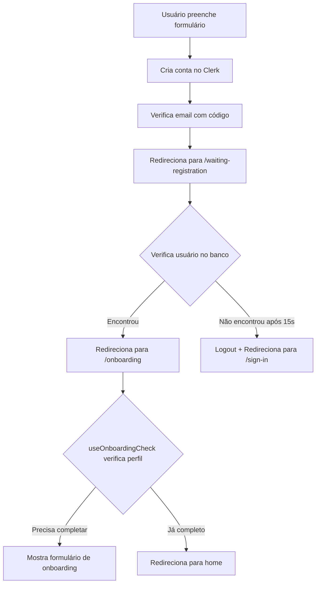
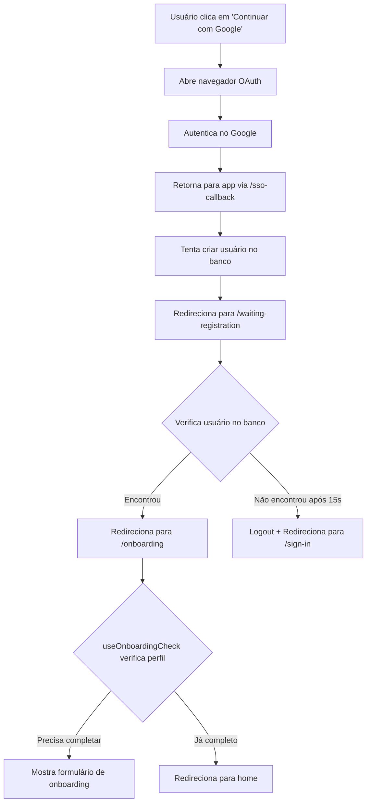

# Correção do Fluxo de Verificação de Cadastro

## 📋 Problema Identificado

### Situação Anterior

Quando um usuário se registrava no Clerk (via email/senha ou SSO), o seguinte fluxo ocorria:

1. ✅ Usuário se registra no Clerk com sucesso
2. ⚠️ Sistema redireciona **imediatamente** para `/onboarding`
3. ⚠️ Hook `useUserVerification` roda **em background** (sem UI)
4. ❌ Quando API retorna 404 (usuário não criado no banco ainda), `useOnboardingCheck` detecta `needsOnboarding: true`
5. ❌ Sistema mostra formulário de onboarding ao invés da tela de "aguardando cadastro"

### Problemas

- **Falta de feedback visual**: Usuário não sabia que o sistema estava verificando se o webhook criou o registro
- **Redirecionamento incorreto**: Em caso de 404, ia direto para onboarding ao invés de mostrar tela de verificação
- **Experiência confusa**: Usuário via formulário de onboarding antes do banco confirmar a criação

## 🔧 Solução Implementada

### 1. Nova Tela de Verificação (`app/waiting-registration.tsx`)

Criamos uma tela dedicada que:

- **Mostra feedback visual claro**: "Finalizando cadastro..."
- **Aguarda webhook processar**: 2 segundos de delay inicial + 15 tentativas de 1 segundo
- **Verifica periodicamente**: Consulta a API a cada 1 segundo para ver se usuário existe
- **Redireciona apropriadamente**:
  - ✅ **Se encontrar**: Redireciona para `/onboarding` (que verifica se precisa completar perfil)
  - ❌ **Se não encontrar após 15s**: Faz logout e redireciona para `/sign-in`

```typescript
// Configurações de tempo
const VERIFICATION_DELAY = 2000; // 2 segundos antes de começar
const POLL_INTERVAL = 1000; // Verificar a cada 1 segundo
const MAX_ATTEMPTS = 15; // Máximo de 15 tentativas (15 segundos)
```

### 2. Atualização do Fluxo de Sign-Up (`app/(auth)/sign-up.tsx`)

**Antes:**
```typescript
// Após verificação de email
startVerification(); // Hook em background
router.replace("/onboarding"); // Redireciona direto
```

**Depois:**
```typescript
// Após verificação de email
router.replace("/waiting-registration"); // Nova tela de verificação
```

### 3. Atualização do Fluxo de SSO (`app/sso-callback.tsx`)

**Antes:**
```typescript
// Após autenticação SSO
startVerification(); // Hook em background
router.replace("/onboarding"); // Redireciona direto
```

**Depois:**
```typescript
// Após autenticação SSO
router.replace("/waiting-registration"); // Nova tela de verificação
```

### 4. Proteção no Hook de Onboarding (`hooks/useOnboardingCheck.ts`)

Adicionamos a rota `waiting-registration` à lista de rotas protegidas que não devem ter verificação de onboarding:

```typescript
const isWaitingRegistrationRoute = currentRoute === "waiting-registration";

// Não verificar onboarding nesta rota
if (isOnboardingRoute || isAuthRoute || isSSOCallbackRoute || isWaitingRegistrationRoute) {
  // Não executar verificação
  return;
}
```

## 🎯 Fluxo Completo Corrigido

### Registro via Email/Senha



### Registro via SSO (Google)



## 📱 Interface da Tela de Verificação

A nova tela `waiting-registration` exibe:

1. **Loading spinner** animado
2. **Título**: "Finalizando cadastro"
3. **Mensagem de status**: 
   - Inicial: "Aguardando criação do usuário..."
   - Durante verificação: "Verificando cadastro no banco de dados..."
   - Sucesso: "Usuário encontrado! Redirecionando..."
   - Erro: "Erro ao criar usuário. Fazendo logout..."
4. **Contador de tentativas**: "Verificação X de 15"
5. **Texto informativo**: "Isso pode levar alguns segundos..."

## ✅ Benefícios da Solução

1. **Feedback visual claro**: Usuário sabe exatamente o que está acontecendo
2. **Experiência mais fluida**: Transição suave entre registro e onboarding
3. **Tratamento de erro apropriado**: Se webhook falhar, usuário é notificado
4. **Tempo de verificação otimizado**: 15 segundos (antes eram 20 segundos)
5. **Código mais organizado**: Lógica de verificação isolada em uma tela dedicada

## 🔄 Arquivos Modificados

1. **`app/waiting-registration.tsx`** (novo): Tela de verificação de cadastro
2. **`app/(auth)/sign-up.tsx`**: Atualizado para redirecionar para nova tela
3. **`app/sso-callback.tsx`**: Atualizado para redirecionar para nova tela
4. **`hooks/useOnboardingCheck.ts`**: Adicionada proteção para rota de verificação

## 📝 Notas Técnicas

- O hook `useUserVerification` foi mantido mas não é mais usado ativamente (pode ser removido em limpeza futura)
- A verificação agora usa diretamente o serviço `userService.getUser()` na própria tela
- A nova tela é mais simples e focada em uma única responsabilidade
- O tempo total de verificação foi reduzido de 20s para 17s (2s delay + 15s de tentativas)

## 🧪 Testes Recomendados

1. **Registro via email**:
   - Criar nova conta
   - Verificar que tela de "aguardando" aparece
   - Confirmar redirecionamento para onboarding após verificação

2. **Registro via Google SSO**:
   - Autenticar com Google
   - Verificar que tela de "aguardando" aparece
   - Confirmar redirecionamento correto

3. **Cenário de erro (webhook lento/falho)**:
   - Simular webhook desabilitado ou muito lento
   - Confirmar que após 15s usuário é deslogado
   - Verificar mensagem de erro apropriada

